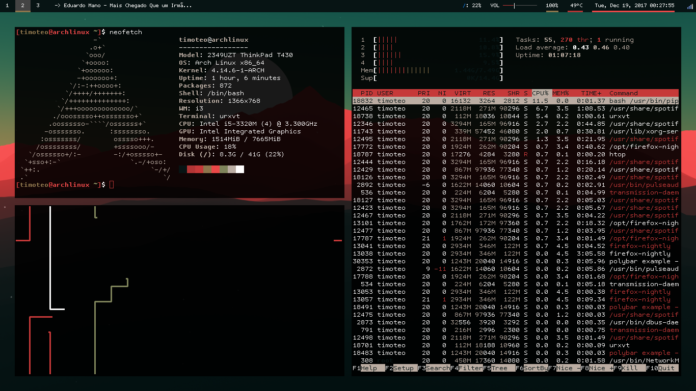
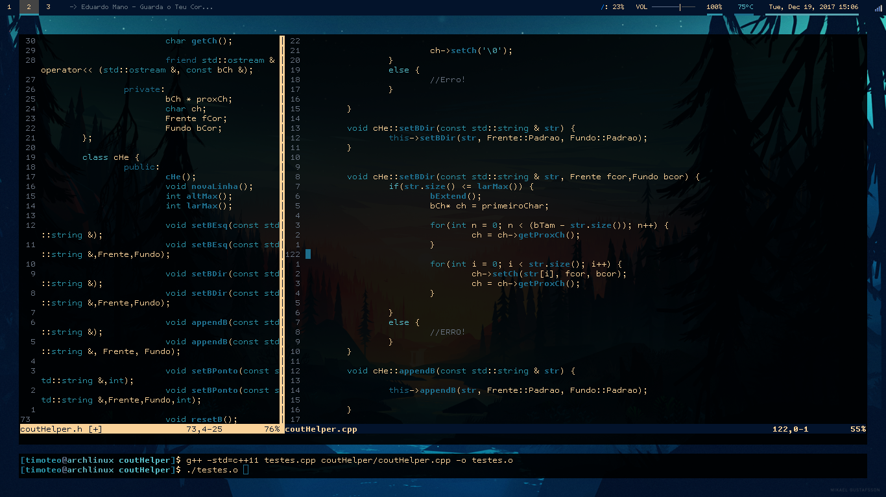

# Script's Automatizados do Timóteo para Produção Extrema

Uma coleção de scripts para instalar e configurar automáticamente um ambiente de trabalho com o objetivo de maximizar a produtividade. Seja como programador ou simples usuário comum.

## O que preciso?
+ Uma instalação do Arch Linux, nova ou não.
+ Conexão com a internet
+ 30 minutos

## Sobre 

O objetivo destes scripts é a facilidade de reprodução do meu ambiente de trabalho atual, tanto para uso próprio quanto distribuição. Qualquer um, seguindo os passos documentados aqui, pode obter minha distribuição e configurações.

Fortemente baseado pelo [Larbs](https://github.com/LukeSmithxyz/LARBS), preparei o sistema para produção de código e rápida alteração de configurações.

## Instalação 

[Siga as instruções da Wiki deste projeto](https://github.com/Timoteohss/SATPX/wiki/Arch-linux-para-iniciantes) para realizar a instalação do sistema em algum drive de seu disco e obter [minhas configurações automáticamente](https://github.com/Timoteohss/dotfiles).

## Características desta instalação 
+ Gerenciamento de janelas pelo i3wm
+ Terminal Urxvt, capaz de múltiplas configurações dinâmicas
+ Vim como editor de texto principal
+ Ranger como navegador de arquivos que roda pelo terminal
+ Qutebrowser para acesso a internet sem mouse (opcional)
+ Spotify
+ Xcompmng para transparência de janelas
+ Pywal para mudar as cores do sistema inteiro baseado no plano de fundo
+ Uma porrada de scripts de automação

